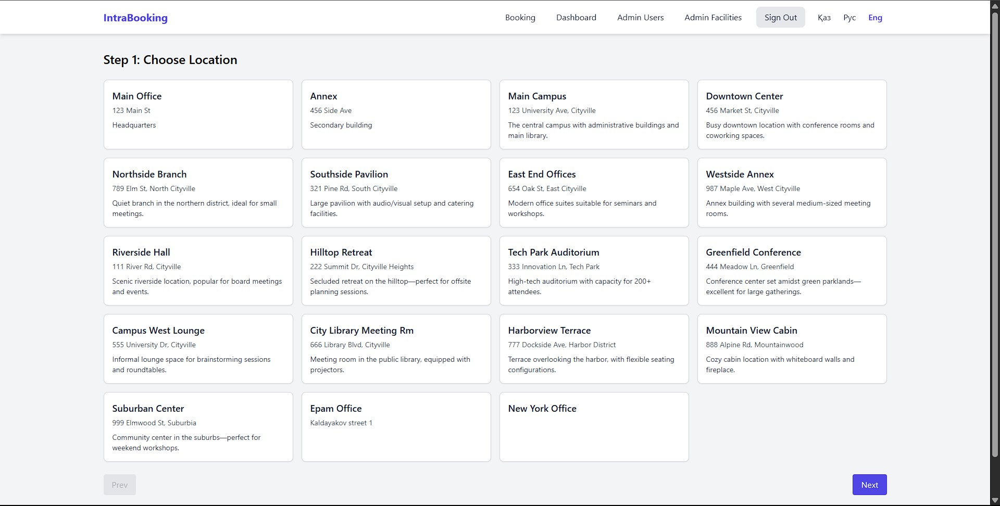

# IntraBooking

IntraBooking is an internal meeting room reservation system. It lets employees book rooms across multiple locations and provides an admin UI for managing locations, rooms, room types, bookings and users. The project also exposes REST endpoints for health checks and Prometheus metrics.

## Application Functionality

The application allows employees to log in with their corporate credentials and browse available rooms. A multi-step wizard guides users through selecting a location, room type and specific room, then choosing a time slot and providing a meeting purpose. Bookings can be reviewed or cancelled from a personal dashboard.

Administrators have access to management screens where they can create or edit locations, room types, individual rooms, statuses and user accounts. All changes are persisted to the database and reflected in the booking workflow immediately.

## Features

- Multi-step wizard to book a room (choose location → room type → specific room → time & purpose).
- Authentication with Spring Security; default admin account is created on startup (`admin` / `admin`).
- Role-based admin panel for managing all domain entities.
- Health check API under `/api/v1/health` and metrics endpoint at `/metrics`.
- Prometheus and Grafana monitoring stack with alerting rules.
- CI/CD pipeline with GitHub Actions and Ansible playbook for remote deployment.

## Database and Entities

PostgreSQL is used to persist application data. The schema is defined in [`src/main/resources/schema.sql`](src/main/resources/schema.sql) and consists of the following tables:

- `roles` – available security roles
- `users` – application users referencing `roles`
- `locations` – office sites where rooms are located
- `room_types` – categories of rooms with typical capacity
- `rooms` – individual rooms belonging to a location and a type
- `statuses` – booking states (e.g. NEW, APPROVED, CANCELLED)
- `bookings` – reservations linking users, rooms and statuses

## Technologies Used

- **Java 21**, **Maven**
- **Spring Framework 6** (MVC, Security, Data)
- **Thymeleaf** templates
- **PostgreSQL** database
- **Tomcat** servlet container
- **Micrometer** with Prometheus registry
- **MapStruct** and **Lombok** for DTO mapping
- **JUnit 5** and **Mockito** for testing
- **Docker** / **Docker Compose**
- **Ansible** for provisioning and deployment

## Running with Docker Compose

1. Install Docker and Docker Compose.
2. Copy `.env` and adjust values if needed (database credentials, Grafana admin password, etc.).
3. Create the external network used by the compose file:
   ```bash
   docker network create intrabooking_net
   ```
4. Start the full stack (application, PostgreSQL, Prometheus, Alertmanager, Grafana):
   ```bash
   docker compose up -d
   ```
5. Application will be available at [http://localhost:8080](http://localhost:8080).
    - Prometheus: <http://localhost:9090>
    - Grafana: <http://localhost:3000>

Login with `admin` / `admin` to access the admin panel.

## Deployment with Ansible

The `ansible` directory contains a playbook that provisions Docker on the target host and deploys the application using the same compose file.

1. Edit `ansible/inventory.ini` with your server IP/SSH key and adjust variables in `group_vars/all.yml` as required.
2. Run the playbook:
   ```bash
   ansible-playbook -i ansible/inventory.ini ansible/playbook.yml
   ```
3. The playbook installs Docker, clones this repository to the server and starts the containers.

## Running Locally without Docker

You can also run the application with a local PostgreSQL instance and an embedded servlet container.

1. Start PostgreSQL and create a database matching the values in `.env` (e.g. `exampleDB`).
2. Set up database tables by `schema.sql` and define main statuses with `data.sql`.
2. Add the following environment variables before running Maven (or define them in your IDE):
   ```bash
   export SPRING_DATASOURCE_URL=jdbc:postgresql://localhost:5432/exampleDB
   export SPRING_DATASOURCE_USERNAME=exampleName
   export SPRING_DATASOURCE_PASSWORD=examplePassword
   export SPRING_DATASOURCE_DRIVER-CLASS-NAME=org.postgresql.Driver
   ```
3. Build and run with the Tomcat Maven plugin:
   ```bash
   mvn clean package
   mvn org.apache.tomcat.maven:tomcat9-maven-plugin:run
   ```
4. Access the app at [http://localhost:8080](http://localhost:8080).

## Screenshots

| Screen                                           | Image                                                                  |
| ------------------------------------------------ | ---------------------------------------------------------------------- |
| Login page                                       |                          |
| Dashboard                                        |                            |
| Booking wizard – Step 1 (Select location)        |                           |
| Booking wizard – Step 2 (Select room type)       |                           |
| Booking wizard – Step 3 (Select room & time)     |                           |
| Confirmed booking                                |            |
| Admin panel – User management                    |              |
| Admin panel – Edit user                          |      |
| Admin panel – Booking management                 |  |
| Admin panel – Facilities creation                |  |

## Running Tests

Execute unit and integration tests with:
```bash
mvn test
```

## License

This project is licensed under the MIT License.